# TaxNet Guardian - Full System Design and Implementation Blueprint

Version: 1.0  
Date: 2026-06-10  
Project theme: Graph AI for Broadening the National Tax Net  
Target: Pakistan-wide hackathon, 3-day MVP with production-grade architecture story  

## 1. Executive Summary

TaxNet Guardian is an explainable graph intelligence platform for identifying tax compliance deviations from fragmented civic and economic datasets. The system links synthetic or approved government records across identity, tax, vehicle, property, utility, business, and travel domains. It builds a knowledge graph, computes a Tax Compliance Deviation Score, generates an explainable audit trail, and routes high-risk cases to human auditors.

The hackathon prototype must not claim access to private NADRA, FBR, Excise, utility, land, or travel records. Instead, it uses a separate Gov Data Sandbox product with its own backend and UI. The sandbox exposes realistic APIs that mimic government systems. Later, real government APIs can replace sandbox providers through the same connector contracts without changing the intelligence pipeline.

The product is designed around five principles:

1. Explainability first: every score has evidence, reasons, and confidence.
2. Human-in-the-loop: AI flags cases for review; it does not accuse or punish.
3. Replaceable integrations: sandbox APIs today, official government APIs later.
4. Privacy by design: PII masking, tokenization, strict audit logs, and controlled access.
5. Model independence: external LLMs, local models, and RAG are behind a Model Gateway.

## 2. Product Positioning

Recommended product name:

```text
TaxNet Guardian
```

One-line pitch:

```text
An explainable graph intelligence platform that helps broaden Pakistan's tax net by linking fragmented civic records, detecting compliance deviations, and giving auditors and citizens a transparent review workflow.
```

Judge-facing pitch:

```text
Because sensitive government APIs are not publicly available for hackathon use, TaxNet Guardian uses a synthetic Gov Data Sandbox with the same API shape expected from official systems. The intelligence pipeline is production-designed so NADRA, FBR, Excise, SECP, utility, land, and travel integrations can replace sandbox providers through connector contracts.
```

## 3. Current Public API Reality

As of 2026-06-10, public official surfaces exist for verification and public lookup, but they should not be treated as open citizen-level APIs for this project.

Known public/official surfaces:

- FBR online verification resources exist through official portals such as `e.fbr.gov.pk` and related FBR/TAX Asaan systems.
- SECP exposes public company search functionality.
- Sindh Excise and Islamabad Excise expose vehicle verification pages.
- PSX exposes public listed company market/company data.
- NADRA identity systems are sensitive and should be treated as private, permissioned government integrations.

Architecture consequence:

```text
Do not scrape or misuse public pages for private citizen intelligence.
Use the sandbox for hackathon data.
Use PublicDataConnector only for public policy documents, notices, fee schedules, and public company/market data where allowed.
Use GovernmentConnector interfaces for future official, permissioned APIs.
```

References:

- AWS Cognito user pools: https://docs.aws.amazon.com/cognito/latest/developerguide/cognito-user-identity-pools.html
- API Gateway HTTP API JWT authorizers: https://docs.aws.amazon.com/apigateway/latest/developerguide/http-api-jwt-authorizer.html
- Cognito resource servers and scopes: https://docs.aws.amazon.com/cognito/latest/developerguide/cognito-user-pools-define-resource-servers.html
- AWS Secrets Manager: https://docs.aws.amazon.com/secretsmanager/latest/userguide/intro.html
- AWS Secrets Manager .NET caching: https://docs.aws.amazon.com/secretsmanager/latest/userguide/retrieving-secrets_cache-net.html
- AWS S3 overview: https://docs.aws.amazon.com/AmazonS3/latest/userguide/Welcome.html
- AWS CloudWatch: https://docs.aws.amazon.com/AmazonCloudWatch/latest/monitoring/WhatIsCloudWatch.html
- AWS SQS: https://docs.aws.amazon.com/AWSSimpleQueueService/latest/SQSDeveloperGuide/welcome.html
- LocalStack docs: https://docs.localstack.cloud/
- Microsoft .NET Aspire overview: https://aspire.dev/get-started/what-is-aspire/

## 4. Goals and Non-Goals

### 4.1 Goals

- Build a working MVP that demonstrates the complete flow from fragmented records to explainable audit case.
- Provide separate Gov Data Sandbox backend and UI.
- Make sandbox APIs replaceable with real government providers later.
- Use Cognito for exposed endpoint authentication.
- Use service-to-service authentication for internal APIs.
- Store secrets in AWS Secrets Manager and retrieve them at runtime.
- Use S3 for raw files, evidence, policy snapshots, and reports.
- Use SQS for asynchronous jobs.
- Use CloudWatch, OpenTelemetry, and structured logs for observability.
- Use RAG for tax policies, official notices, SOPs, and explanation grounding.
- Use a Model Gateway so OpenAI, Claude, Gemini, or a local model can be swapped.
- Include local model training/fine-tuning as a controlled MLOps loop, not live self-training.
- Include citizen correction workflow to reduce false positives and increase trust.

### 4.2 Non-Goals

- Do not directly integrate with private NADRA/FBR/Excise production APIs during the hackathon.
- Do not claim AI proves fraud.
- Do not train models directly on raw citizen data.
- Do not scrape private citizen records from government pages.
- Do not build too many physical microservices in the 3-day MVP if it slows delivery.
- Do not put all intelligence in the LLM. The graph, rules, scoring, and evidence store must be authoritative.

## 4A. Implemented MVP Service Map

The current hackathon implementation runs as one .NET API/static host for speed, but it keeps the production service boundaries visible. The React app calls the same HTTP contracts that would later sit behind API Gateway and separate services.

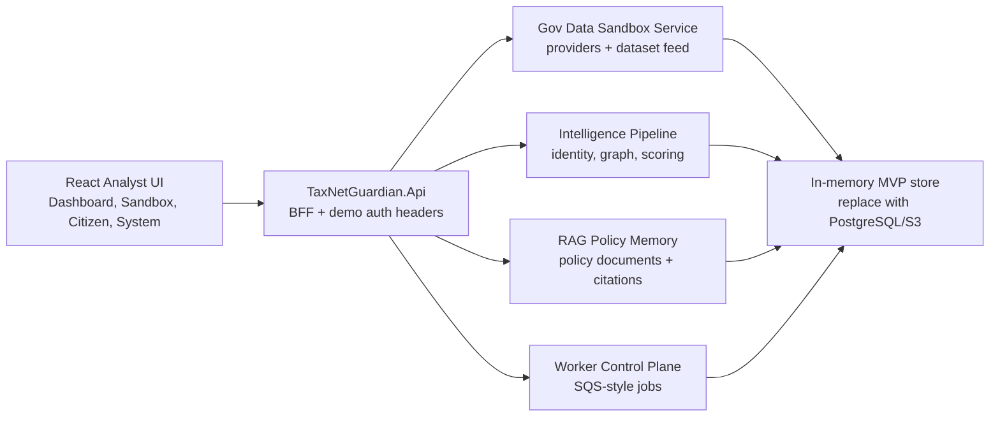

Implemented UI modules:

- `/` National Dashboard, case queue, investigation graph, evidence drawer, assistant drawer.
- `/sandbox` Gov Data Sandbox with synthetic generation, provider cards, official-ready configuration, schema templates, CSV/JSON dataset feed, import jobs, and provider record preview.
- `/citizen` Citizen-safe explanation and correction submission.
- System Control inside the SPA with worker queues, Cognito-ready authorization matrix, RAG policy feed, and model gateway routing.

Implemented service contracts:

- `GET /api/sandbox/datasets/templates`: returns dataset schemas and CSV examples for `identity`, `tax`, `vehicle`, `property`, `utility`, `business`, and `travel`.
- `POST /api/sandbox/datasets/feed`: accepts CSV or JSON records, applies them to the sandbox data store, and optionally reruns the scoring pipeline.
- `PATCH /api/sandbox/providers/{providerCode}`: records official-provider readiness settings such as base URL, credential secret name, enabled status, rate limit, and notes.
- `POST /api/system/rag/documents`: indexes a policy/circular/web document into the RAG memory surface.
- `GET /api/system/workers`: returns worker health plus recent import/RAG jobs for the operational demo.

The demo intentionally uses in-memory storage to remain portable during the hackathon. Production replacement targets remain PostgreSQL for normalized records, S3 for raw files, SQS for jobs, Qdrant/pgvector for embeddings, CloudWatch for logs/metrics, and Secrets Manager for provider credentials.

## 5. Personas

### 5.1 Tax Auditor

Needs:

- View prioritized high-risk cases.
- Understand why each case was flagged.
- Inspect graph relationships.
- Request more evidence.
- Approve, reject, or send case for citizen clarification.
- Generate an audit report.

### 5.2 Senior FBR/Government Analyst

Needs:

- Monitor national/city/sector risk patterns.
- See estimated revenue opportunity.
- Track audit workload.
- Monitor false positive rates.
- Review model and scoring health.

### 5.3 Citizen/Taxpayer

Needs:

- See if records are mismatched.
- Submit corrections and evidence.
- Understand why their profile was flagged.
- Receive compliance guidance.
- Track review status.

### 5.4 Sandbox Administrator

Needs:

- Generate synthetic datasets.
- Create suspicious cases.
- Configure mock government APIs.
- Simulate downtime, latency, stale data, and bad data.
- Later configure real government API adapters.

### 5.5 System Administrator

Needs:

- Manage users, groups, roles, secrets, and provider configurations.
- Monitor queues, logs, metrics, costs, and alerts.

## 6. High-Level Architecture

```mermaid
flowchart TB
  subgraph ClientApps["Client Applications"]
    AD["Auditor Dashboard\nReact"]
    CP["Citizen Portal\nReact"]
    SU["Sandbox Admin UI\nReact"]
  end

  subgraph Edge["External Edge"]
    APIGW["API Gateway / BFF\nASP.NET Core or AWS API Gateway"]
    COG["Amazon Cognito\nUser Pools"]
  end

  subgraph Domain["Core Domain Services"]
    CASE["Case Management Service"]
    ING["Ingestion Service"]
    IDR["Identity Resolution Service"]
    GRAPH["Graph Intelligence Service"]
    RISK["Risk Scoring Service"]
    XAI["Explainability Service"]
    REPORT["Report Service"]
    NOTIF["Notification Service"]
    AUDIT["Audit Log Service"]
  end

  subgraph AI["AI Platform"]
    ORCH["AI Orchestrator\nThe Big Mind Controller"]
    MODEL["Model Gateway"]
    RAG["RAG Policy Service"]
    EMB["Embedding Worker"]
    LOCAL["Local Inference Service"]
    MLOPS["Training and Evaluation Pipeline"]
  end

  subgraph Sandbox["Gov Data Sandbox Product"]
    SANAPI["GovDataSandbox.Api"]
    SANUI["GovDataSandbox.UI"]
    SANDB["Sandbox PostgreSQL"]
  end

  subgraph Connectors["Government and Public Connectors"]
    CONN["Government Connector Service"]
    PUBLIC["Public Data Connector Worker"]
    NADRA["Future NADRA Adapter"]
    FBR["Future FBR Adapter"]
    EXCISE["Future Excise Adapter"]
    SECP["SECP/Public Adapter"]
    UTIL["Future Utility Adapter"]
  end

  subgraph Data["Data Stores and Infra"]
    PG["PostgreSQL\nOperational DB"]
    GDB["Neo4j or Memgraph\nKnowledge Graph"]
    VDB["Qdrant or pgvector\nVector DB"]
    REDIS["Redis Cache"]
    S3["S3\nRaw data, evidence, reports"]
    SQS["SQS Queues + DLQ"]
    SECRETS["AWS Secrets Manager"]
    CW["CloudWatch Logs, Metrics, Alarms"]
  end

  AD --> APIGW
  CP --> APIGW
  SU --> SANAPI
  APIGW --> COG
  APIGW --> CASE
  CASE --> ING
  CASE --> IDR
  CASE --> GRAPH
  CASE --> RISK
  CASE --> XAI
  CASE --> REPORT
  XAI --> ORCH
  ORCH --> MODEL
  ORCH --> RAG
  MODEL --> LOCAL
  RAG --> VDB
  ING --> CONN
  CONN --> SANAPI
  CONN --> NADRA
  CONN --> FBR
  CONN --> EXCISE
  CONN --> SECP
  CONN --> UTIL
  PUBLIC --> S3
  PUBLIC --> RAG
  Domain --> PG
  GRAPH --> GDB
  REPORT --> S3
  Domain --> SQS
  Domain --> SECRETS
  Domain --> CW
  AI --> CW
  Sandbox --> CW
```

## 7. Recommended Technology Stack

### 7.1 Hackathon MVP Stack

Backend:

- .NET 10 / ASP.NET Core Web API
- .NET Worker Services
- .NET Aspire for local orchestration if templates/packages are available
- PostgreSQL
- Neo4j or Memgraph for graph storage
- Qdrant or pgvector for vector search
- Redis for cache
- SQS and S3 through LocalStack locally
- Serilog + OpenTelemetry

Frontend:

- React
- Vite
- TypeScript
- Tailwind CSS
- shadcn/ui
- TanStack Query
- Zustand or Redux Toolkit
- Cytoscape.js for graph visualization
- Recharts for dashboards

AI:

- AI Orchestrator in .NET
- Model Gateway in .NET
- RAG service in .NET or Python
- Embedding worker in .NET or Python
- External LLM through provider APIs
- Local model through Ollama or vLLM if time allows

Infrastructure:

- Docker Compose locally
- LocalStack for S3, SQS, and Secrets Manager local simulation
- AWS deployment target: ECS Fargate or EKS
- AWS CloudWatch for logs, metrics, alarms
- AWS Secrets Manager for secrets
- AWS KMS for encryption keys
- AWS Cognito for auth

### 7.2 Production Stack

Recommended AWS production target:

- CloudFront for frontend delivery
- S3 static hosting or Amplify for React apps
- API Gateway or ALB for API ingress
- Cognito User Pools for user auth
- ECS Fargate for .NET services
- SQS for async jobs
- S3 for object storage
- RDS PostgreSQL for operational data
- Amazon ElastiCache Redis
- Amazon OpenSearch optional for text search/log exploration
- Neo4j Aura, Amazon Neptune, or self-managed Memgraph/Neo4j for graph
- Qdrant Cloud, pgvector, or OpenSearch vector search for RAG
- Secrets Manager and KMS
- CloudWatch Logs, Metrics, Alarms
- X-Ray or OpenTelemetry collector for distributed tracing

## 8. Service Inventory

### 8.1 API Gateway / BFF

Project:

```text
TaxNet.ApiGateway
```

Responsibilities:

- Expose frontend-facing APIs.
- Validate Cognito JWT tokens.
- Enforce role and scope-based authorization.
- Route calls to internal services.
- Aggregate case detail data for frontend.
- Apply request rate limiting.
- Add correlation IDs.
- Hide internal service topology from clients.

External authentication:

- Cognito User Pool JWTs.
- API Gateway HTTP API JWT authorizer or ASP.NET Core JWT bearer validation.

Main exposed route groups:

```http
/api/dashboard/*
/api/cases/*
/api/graph/*
/api/reports/*
/api/citizen/*
/api/assistant/*
/api/admin/*
```

### 8.2 Auth Service / Cognito Integration

TaxNet should not implement password storage itself.

Use Cognito for:

- User sign-up/sign-in if enabled.
- Hosted UI or custom UI auth flow.
- JWT access tokens.
- Groups and roles.
- Machine-to-machine OAuth client credentials for service accounts.

Recommended Cognito groups:

```text
taxnet-admin
taxnet-auditor
taxnet-supervisor
taxnet-citizen
taxnet-sandbox-admin
taxnet-model-admin
taxnet-readonly-analyst
```

Recommended OAuth scopes:

```text
taxnet/cases.read
taxnet/cases.write
taxnet/cases.review
taxnet/graph.read
taxnet/risk.read
taxnet/reports.generate
taxnet/citizen.read_self
taxnet/citizen.submit_correction
taxnet/sandbox.admin
taxnet/connectors.admin
taxnet/models.admin
taxnet/audit.read
```

### 8.3 Case Management Service

Project:

```text
TaxNet.CaseManagement.Api
```

Responsibilities:

- Own case lifecycle.
- Store assigned auditor, status, score, evidence references, and decisions.
- Coordinate with graph, risk, explanation, report, and citizen correction services.
- Provide case workspace APIs.

Case states:

```text
Created
Scored
FlaggedForReview
Assigned
UnderReview
CitizenClarificationRequested
CitizenResponded
EvidenceVerified
ClosedNoAction
ClosedEscalated
ClosedRecovered
ClosedFalsePositive
```

Main APIs:

```http
GET    /internal/cases
GET    /internal/cases/{caseId}
POST   /internal/cases
POST   /internal/cases/{caseId}/assign
POST   /internal/cases/{caseId}/request-citizen-clarification
POST   /internal/cases/{caseId}/decision
GET    /internal/cases/{caseId}/timeline
GET    /internal/cases/{caseId}/evidence
```

### 8.4 Ingestion Service

Project:

```text
TaxNet.Ingestion.Api
TaxNet.Ingestion.Worker
```

Responsibilities:

- Start imports from sandbox or real providers.
- Validate schema and source trust level.
- Store raw input snapshots in S3.
- Normalize into canonical records.
- Emit SQS events for identity resolution.

Inputs:

- Sandbox API responses.
- CSV uploads.
- Public policy documents.
- Future official API responses.

Outputs:

- Raw snapshot in S3.
- Normalized records in PostgreSQL.
- `RecordBatchImported` event.

### 8.5 Identity Resolution Service

Project:

```text
TaxNet.IdentityResolution.Worker
```

Responsibilities:

- Link records likely belonging to the same person or organization.
- Use deterministic matching for strong identifiers.
- Use fuzzy matching for names and addresses.
- Produce confidence scores and match reasons.
- Avoid automatic high-confidence merges when evidence is weak.

Matching signals:

- CNIC hash or masked CNIC similarity.
- Phone number.
- NTN/STRN.
- Passport hash.
- Name similarity.
- Father name similarity.
- Address similarity.
- City/tehsil match.
- Date of birth band if available.
- Business director relationship.

Outputs:

- `ResolvedEntity` records.
- `IdentityClusterCreated` event.
- Match explanations.

### 8.6 Graph Intelligence Service

Project:

```text
TaxNet.GraphIntelligence.Api
TaxNet.GraphIntelligence.Worker
```

Responsibilities:

- Build and query knowledge graph.
- Store person, asset, business, utility, tax, travel, and address nodes.
- Create relationships.
- Provide graph neighborhoods to dashboard.
- Extract graph features for risk scoring.

Graph store:

- MVP: Neo4j, Memgraph, or NetworkX JSON if graph DB is unavailable.
- Production: Neo4j, Memgraph, or Amazon Neptune.

### 8.7 Risk Scoring Service

Project:

```text
TaxNet.RiskScoring.Worker
TaxNet.RiskScoring.Api
```

Responsibilities:

- Calculate Tax Compliance Deviation Score.
- Combine deterministic rules, anomaly models, and graph features.
- Store score breakdowns.
- Emit high-risk alerts.

Scoring model:

```text
TotalScore =
  25% AssetIncomeMismatch
  20% UtilityIncomeMismatch
  15% VehicleLuxurySignal
  15% PropertyOwnershipMismatch
  10% BusinessOwnershipMismatch
  10% TravelLifestyleMismatch
   5% FilingBehaviorSignal
```

Risk bands:

```text
0-30   Low
31-60  Medium
61-80  High
81-100 Critical
```

### 8.8 Explainability Service

Project:

```text
TaxNet.Explainability.Api
```

Responsibilities:

- Convert risk signals into plain-language explanations.
- Generate evidence-backed audit trails.
- Generate citizen-safe explanations.
- Call AI Orchestrator for natural language drafts.
- Validate that every AI explanation maps to structured evidence.

Rule:

```text
No explanation may include a claim that is not backed by structured evidence or cited policy context.
```

### 8.9 AI Orchestrator Service

Project:

```text
TaxNet.AI.Orchestrator.Api
```

Role:

The AI Orchestrator is the "big mind controller." It decides what context to collect, which tools to call, which model route to use, and how to validate output.

Responsibilities:

- Build prompts from graph, score, evidence, and RAG context.
- Call Model Gateway.
- Call RAG Policy Service.
- Enforce output schemas.
- Redact or mask sensitive PII before model calls when needed.
- Generate case summaries, reports, and recommendations.
- Provide audit assistant responses.

It should not own:

- Core score decisions.
- Raw citizen records.
- Case state.
- Government API credentials.

### 8.10 Model Gateway

Project:

```text
TaxNet.AI.ModelGateway.Api
```

Responsibilities:

- Route model requests to OpenAI, Claude, Gemini, or local models.
- Apply policy-based routing.
- Track token usage and cost.
- Apply retries and fallback.
- Enforce provider-specific limits.
- Cache safe repeated outputs when appropriate.

Routing examples:

```text
Complex case explanation -> external frontier LLM
Simple report formatting -> local model
Citizen-friendly rewrite -> local or external model
Policy question -> RAG + selected model
High sensitivity case -> local model or redacted external prompt
```

### 8.11 RAG Policy Service

Project:

```text
TaxNet.RagPolicy.Api
TaxNet.RagPolicy.Worker
```

Responsibilities:

- Store and retrieve public tax/legal/policy context.
- Ingest public FBR notices, tax schedules, audit SOPs, public excise fee schedules, and approved policy PDFs.
- Chunk documents.
- Generate embeddings.
- Store vectors.
- Return citations with retrieved context.

RAG should be used for:

- Latest public tax policy.
- Official notices.
- Filing thresholds.
- Audit SOPs.
- Explanation grounding.

RAG should not be used for:

- Private citizen records.
- Identity resolution.
- Raw government records.
- Replacing structured graph facts.

### 8.12 Public Data Connector Worker

Project:

```text
TaxNet.PublicDataConnector.Worker
```

Responsibilities:

- Fetch approved public pages and documents.
- Store raw snapshots in S3.
- Extract text.
- Send documents to RAG indexing.
- Track source URL, capture time, hash, and parser version.

Approved source types:

- Public tax notices.
- Public fee schedules.
- Public company/market data where permitted.
- Public policy PDFs.
- Public government press releases.

Not approved:

- Private citizen verification pages.
- Scraping citizen-level records.
- Any source blocked by terms, authentication, CAPTCHA, or privacy restrictions.

### 8.13 Report Service

Project:

```text
TaxNet.Report.Worker
```

Responsibilities:

- Generate PDF case reports.
- Generate CSV exports for supervisors.
- Store reports in S3.
- Apply watermarks and access controls.
- Record who generated each report.

Report sections:

- Case summary.
- Risk score.
- Evidence table.
- Graph snapshot.
- Policy citations.
- Auditor notes.
- Citizen correction history.
- Final recommendation.

### 8.14 Notification Service

Project:

```text
TaxNet.Notification.Worker
```

Responsibilities:

- Send alerts to auditors/admins.
- Send citizen portal notifications.
- Send supervisor escalation notices.
- Integrate with email/SMS later.

MVP:

- In-app notifications only.

Production:

- Amazon SNS.
- Email.
- SMS provider.
- Government notification platform if available.

### 8.15 Audit Log Service

Project:

```text
TaxNet.AuditLog.Api
TaxNet.AuditLog.Worker
```

Responsibilities:

- Store immutable audit events.
- Track every data access.
- Track every score change.
- Track every model output.
- Track every citizen correction.
- Track every report export.

Audit log fields:

```json
{
  "eventId": "evt_123",
  "timestampUtc": "2026-06-10T11:30:00Z",
  "actorType": "User|Service|Model",
  "actorId": "user_abc",
  "service": "RiskScoring",
  "action": "CaseScoreCalculated",
  "resourceType": "Case",
  "resourceId": "case_001",
  "correlationId": "corr_001",
  "ipAddress": "masked",
  "metadata": {}
}
```

### 8.16 Gov Data Sandbox Product

Projects:

```text
TaxNet.GovDataSandbox.Api
TaxNet.GovDataSandbox.UI
```

The sandbox is a separate product with separate UI and backend.

Purpose:

- Emulate government data providers.
- Generate realistic synthetic data.
- Provide controlled APIs for the main TaxNet system.
- Let judges see how real API replacement will work.
- Let demo team create edge cases and suspicious profiles.

The sandbox must be isolated from the main TaxNet business services. TaxNet reads from it through connector interfaces, just as it would read from official government APIs later.

## 9. Gov Data Sandbox Detailed Design

### 9.1 Sandbox Architecture

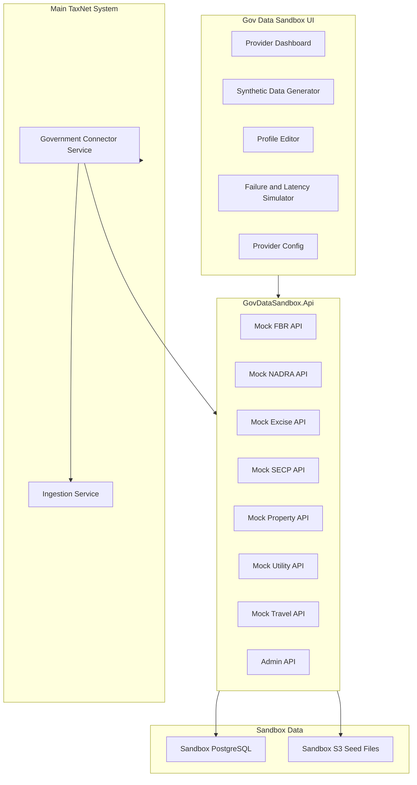

### 9.2 Sandbox UI Features

The sandbox UI is for admins and demo operators.

Screens:

1. Provider dashboard
   - Shows mock NADRA, FBR, Excise, SECP, Property, Utility, Travel providers.
   - Shows status: healthy, degraded, offline.
   - Shows request count and latency.

2. Synthetic citizen generator
   - Generate N citizens.
   - Choose city distribution.
   - Choose suspicious case percentage.
   - Choose typo/noise level.
   - Choose Urdu/English mixed name percentage.

3. Profile editor
   - Edit a synthetic citizen profile.
   - Add vehicle, property, utility bill, business, travel, tax return.
   - Mark expected risk level for demo/evaluation.

4. Suspicious pattern builder
   - Non-filer with luxury vehicle.
   - Zero tax return with high utility bill.
   - Low declared income with property ownership.
   - Director of multiple companies but no income.
   - Frequent foreign travel with no declared income.
   - Multiple identities likely same person.

5. API key/provider config
   - Create sandbox client keys.
   - Rotate sandbox key.
   - Configure rate limits.
   - Configure response latency.

6. Failure simulator
   - Set provider offline.
   - Return stale data.
   - Return partial data.
   - Return 429 rate limit.
   - Return 500 error.

7. Real provider readiness
   - Show adapter contract.
   - Show required credentials.
   - Show environment variable/Secrets Manager secret name.
   - Mark provider as Sandbox, Public, Official, or Disabled.

### 9.3 Sandbox Backend Endpoints

Admin endpoints:

```http
POST   /sandbox/admin/seed
POST   /sandbox/admin/reset
POST   /sandbox/admin/generate-citizens
GET    /sandbox/admin/providers
PATCH  /sandbox/admin/providers/{providerCode}
GET    /sandbox/admin/profiles
GET    /sandbox/admin/profiles/{syntheticPersonId}
PATCH  /sandbox/admin/profiles/{syntheticPersonId}
POST   /sandbox/admin/profiles/{syntheticPersonId}/assets
POST   /sandbox/admin/failure-rules
DELETE /sandbox/admin/failure-rules/{ruleId}
```

Mock NADRA-like endpoints:

```http
GET /sandbox/nadra/identity/{identityToken}
GET /sandbox/nadra/family-links/{identityToken}
GET /sandbox/nadra/address-history/{identityToken}
```

Mock FBR-like endpoints:

```http
GET /sandbox/fbr/taxpayer/{identityToken}
GET /sandbox/fbr/atl-status/{ntn}
GET /sandbox/fbr/returns/{identityToken}
GET /sandbox/fbr/withholding/{identityToken}
```

Mock Excise endpoints:

```http
GET /sandbox/excise/vehicles?identityToken={token}
GET /sandbox/excise/vehicle/{registrationNumber}
```

Mock SECP endpoints:

```http
GET /sandbox/secp/companies?directorIdentityToken={token}
GET /sandbox/secp/company/{companyRegistrationNumber}
```

Mock Property endpoints:

```http
GET /sandbox/property/ownership?identityToken={token}
GET /sandbox/property/transactions?identityToken={token}
```

Mock Utility endpoints:

```http
GET /sandbox/utilities/bills?identityToken={token}
GET /sandbox/utilities/meters/{meterNumber}
```

Mock Travel endpoints:

```http
GET /sandbox/travel/history?identityToken={token}
```

### 9.4 Sandbox API Authentication

For hackathon local mode:

- Sandbox UI users authenticate through Cognito or local dev JWT.
- Main TaxNet connector authenticates to sandbox API using service-to-service OAuth or a sandbox API key.

Recommended production-like mode:

- Use Cognito machine-to-machine client credentials for TaxNet services.
- Use scopes such as `sandbox/read`, `sandbox/admin`.
- Store client secret in Secrets Manager.

Fallback dev mode:

- `X-Sandbox-Api-Key` header.
- API key stored in Secrets Manager or LocalStack Secrets Manager.
- Only enabled in `Development` profile.

### 9.5 Sandbox Data Model

Tables:

```text
SyntheticPersons
SyntheticIdentityDocuments
SyntheticTaxProfiles
SyntheticTaxReturns
SyntheticVehicles
SyntheticProperties
SyntheticUtilityBills
SyntheticBusinesses
SyntheticBusinessDirectors
SyntheticTravelRecords
SyntheticAddresses
SyntheticPhones
SyntheticAliases
ProviderConfigs
FailureRules
SandboxApiRequestLogs
```

SyntheticPersons:

```text
SyntheticPersonId
FullNameEnglish
FullNameUrdu
FatherName
DateOfBirthYear
Gender
City
Province
IdentityToken
CnicMasked
CnicHash
PhoneHash
ExpectedRiskBand
CreatedAtUtc
```

Important:

- Use `IdentityToken` as a synthetic stand-in for CNIC/NADRA identifiers.
- Store masked CNIC-like values only.
- Never use real citizen CNICs.

### 9.6 Real Government API Replacement Strategy

All provider access goes through an interface. The main system never directly calls sandbox-specific endpoints.

```csharp
public interface IGovernmentDataProvider
{
    string ProviderCode { get; }
    Task<ProviderHealthResult> CheckHealthAsync(CancellationToken ct);
    Task<TaxProfileDto?> GetTaxProfileAsync(IdentityToken token, CancellationToken ct);
    Task<IdentityProfileDto?> GetIdentityProfileAsync(IdentityToken token, CancellationToken ct);
    Task<IReadOnlyList<VehicleRecordDto>> GetVehicleRecordsAsync(IdentityToken token, CancellationToken ct);
    Task<IReadOnlyList<PropertyRecordDto>> GetPropertyRecordsAsync(IdentityToken token, CancellationToken ct);
    Task<IReadOnlyList<BusinessRecordDto>> GetBusinessRecordsAsync(IdentityToken token, CancellationToken ct);
    Task<IReadOnlyList<UtilityBillRecordDto>> GetUtilitySignalsAsync(IdentityToken token, CancellationToken ct);
    Task<IReadOnlyList<TravelRecordDto>> GetTravelSignalsAsync(IdentityToken token, CancellationToken ct);
}
```

Provider implementations:

```csharp
public sealed class SandboxGovernmentDataProvider : IGovernmentDataProvider
{
    // Calls GovDataSandbox.Api
}

public sealed class NadraGovernmentDataProvider : IGovernmentDataProvider
{
    // Future official NADRA integration.
    // Requires approved API contract, credentials, audit controls, and legal authorization.
}

public sealed class FbrGovernmentDataProvider : IGovernmentDataProvider
{
    // Future official FBR integration.
}

public sealed class ExciseGovernmentDataProvider : IGovernmentDataProvider
{
    // Future provincial excise integration.
}

public sealed class SecpGovernmentDataProvider : IGovernmentDataProvider
{
    // Public or official SECP integration depending on data source.
}
```

Provider registry:

```csharp
public interface IGovernmentProviderRegistry
{
    Task<IReadOnlyList<ProviderDescriptor>> ListProvidersAsync(CancellationToken ct);
    Task<IGovernmentDataProvider> GetProviderAsync(string providerCode, CancellationToken ct);
}
```

Provider descriptor:

```json
{
  "providerCode": "FBR",
  "mode": "Sandbox|Public|Official|Disabled",
  "baseUrlSecretName": "taxnet/providers/fbr/base-url",
  "credentialSecretName": "taxnet/providers/fbr/credentials",
  "supportsHealthCheck": true,
  "supportsBulkImport": false,
  "lastHealthStatus": "Healthy"
}
```

## 10. Authentication and Authorization

### 10.1 External Endpoint Auth

Use Amazon Cognito User Pools.

External users:

- Auditors
- Supervisors
- Admins
- Citizens
- Sandbox admins

Flow:

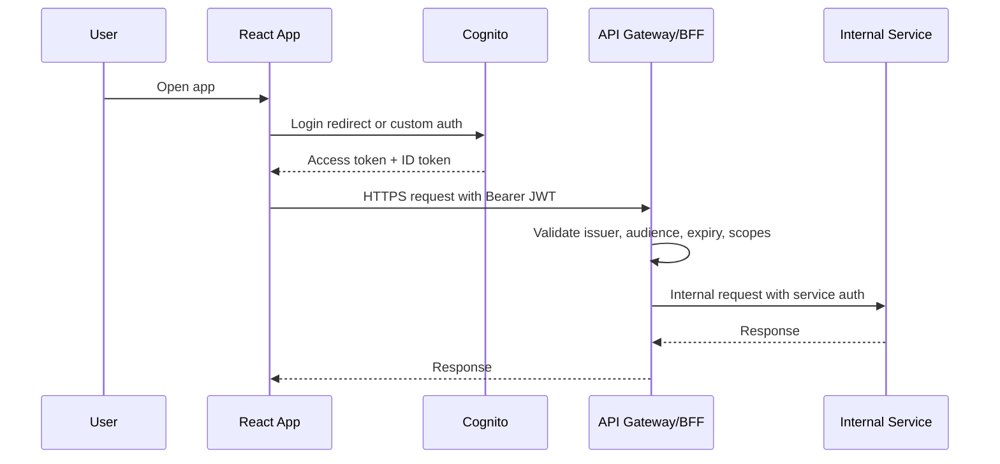

Use JWT claims:

```text
sub
email
cognito:groups
scope
aud
iss
exp
```

Authorization examples:

```text
taxnet-admin can manage providers and users.
taxnet-auditor can review assigned cases.
taxnet-supervisor can view regional dashboards and assign cases.
taxnet-citizen can only view own portal profile and corrections.
taxnet-sandbox-admin can manage sandbox data.
taxnet-model-admin can manage model routing and evaluation.
```

### 10.1.1 Authorization Model

Use a hybrid authorization model:

```text
RBAC = role-based access control for broad app capabilities.
Scopes = OAuth permissions for APIs and service-to-service access.
ABAC = attribute-based checks for data ownership, region, assignment, and sensitivity.
```

The system should not rely only on frontend route hiding. Every backend endpoint must enforce authorization.

Decision order:

```text
1. Authenticate caller.
2. Validate token issuer, audience, expiry, and signature.
3. Read groups/scopes from token.
4. Map token to TaxNet principal.
5. Check RBAC permission.
6. Check ABAC conditions such as assigned case, region, citizen ownership, or data sensitivity.
7. Write authorization decision to audit log for sensitive actions.
```

Authorization components:

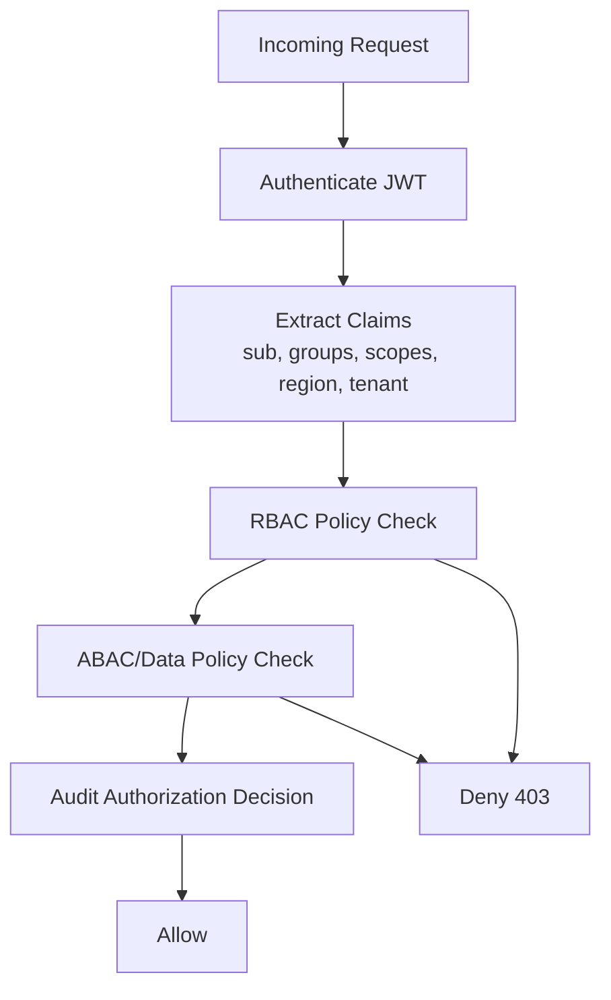

### 10.1.2 User Roles

Recommended Cognito groups and application roles:

| Role | Cognito Group | Purpose |
|---|---|---|
| Platform Admin | `taxnet-admin` | Full system administration except raw secret values |
| Security Admin | `taxnet-security-admin` | Manage auth policy, audit access, security configuration |
| Sandbox Admin | `taxnet-sandbox-admin` | Manage synthetic data, sandbox providers, failure simulation |
| Data Engineer | `taxnet-data-engineer` | Run imports, inspect ingestion quality, manage schemas |
| Tax Auditor | `taxnet-auditor` | Review assigned cases, evidence, graph, and explanations |
| Senior Auditor | `taxnet-senior-auditor` | Reassign cases, approve escalations, close major cases |
| Supervisor | `taxnet-supervisor` | Regional/city dashboard, workload monitoring, case assignment |
| Policy Analyst | `taxnet-policy-analyst` | Manage RAG policy documents, review citations and policy updates |
| Model Admin | `taxnet-model-admin` | Configure model routing, evaluate local models, manage prompts |
| Readonly Analyst | `taxnet-readonly-analyst` | View aggregated dashboards and anonymized case summaries |
| Citizen | `taxnet-citizen` | View own safe profile, submit corrections, upload documents |
| Support Officer | `taxnet-support` | Help citizens with portal issues without seeing full risk internals |
| Service Account | Cognito app client | Machine-to-machine internal communication |

### 10.1.3 Permission Matrix

Legend:

```text
R = read
W = write/create/update
A = approve/administrate
N = no access
Own = only own records
Assigned = only assigned cases
Region = only allowed region/city
Masked = masked or aggregated data only
```

| Capability | Admin | Security Admin | Sandbox Admin | Data Engineer | Auditor | Senior Auditor | Supervisor | Policy Analyst | Model Admin | Readonly Analyst | Citizen | Support |
|---|---|---|---|---|---|---|---|---|---|---|---|---|
| User/role management | A | A | N | N | N | N | N | N | N | N | N | N |
| Provider configuration | A | R | A for sandbox | R | N | N | R | N | N | N | N | N |
| Sandbox data generation | R | N | A | W | N | N | N | N | N | N | N | N |
| Ingestion jobs | A | R | R | A | N | N | R | N | N | N | N | N |
| Case list | R | R masked | N | R masked | Assigned | Region | Region | N | N | Masked | Own safe view | Own support view |
| Case detail | R | R masked | N | R technical | Assigned | Assigned/Region | Region | N | N | Masked | Own safe view | Own support view |
| Graph explorer | R | R masked | N | R technical | Assigned | Assigned/Region | Region | N | N | Masked | N | N |
| Evidence files | R | R audit only | N | R technical | Assigned | Assigned/Region | Region | N | N | N | Own submitted files | Own submitted files |
| Risk score details | R | R masked | N | R technical | Assigned | Assigned/Region | Region | N | N | Aggregated only | Safe summary only | N |
| AI assistant | A | R audit | N | N | Assigned | Assigned/Region | Region | R policy only | A | N | Own guidance only | Own guidance only |
| RAG policy docs | R | R | N | R | R | R | R | A | R | R | Public guidance only | Public guidance only |
| Model routing config | R | R | N | N | N | N | N | R | A | N | N | N |
| Prompt/output audit logs | R | A | N | N | N | R | R | R | A | N | N | N |
| Citizen corrections | R | R masked | N | N | Assigned | Assigned/Region | Region | N | N | Aggregated only | Own | Own support view |
| Final case decision | N | N | N | N | Assigned limited | A | A regional | N | N | N | N | N |
| Audit log access | R | A | Sandbox only | Technical only | Own actions | Region actions | Region actions | Policy actions | Model actions | N | Own actions | Own support actions |
| Reports export | A | R masked | N | N | Assigned | Assigned/Region | Region | N | N | Aggregated only | Own receipt only | N |

### 10.1.4 API Scope Matrix

External user scopes:

| Scope | Allowed Callers | Example APIs |
|---|---|---|
| `taxnet/dashboard.read` | Admin, Supervisor, Readonly Analyst | `GET /api/dashboard/*` |
| `taxnet/cases.read` | Admin, Auditor, Senior Auditor, Supervisor | `GET /api/cases` |
| `taxnet/cases.write` | Admin, Senior Auditor, Supervisor | `POST /api/cases/{id}/assign` |
| `taxnet/cases.review` | Auditor, Senior Auditor | `POST /api/cases/{id}/decision` |
| `taxnet/graph.read` | Admin, Auditor, Senior Auditor, Supervisor | `GET /api/graph/*` |
| `taxnet/evidence.read` | Admin, Auditor, Senior Auditor, Supervisor | `GET /api/cases/{id}/evidence` |
| `taxnet/reports.generate` | Admin, Auditor, Senior Auditor, Supervisor | `POST /api/reports` |
| `taxnet/citizen.read_self` | Citizen | `GET /api/citizen/me` |
| `taxnet/citizen.submit_correction` | Citizen | `POST /api/citizen/corrections` |
| `taxnet/sandbox.admin` | Sandbox Admin, Admin | `/sandbox/admin/*` |
| `taxnet/policy.manage` | Policy Analyst, Admin | `/api/policy/*` |
| `taxnet/models.manage` | Model Admin, Admin | `/api/models/*` |
| `taxnet/audit.read` | Security Admin, Admin | `/api/audit/*` |

Internal service scopes:

| Scope | Used By | Grants |
|---|---|---|
| `taxnet/internal.ingestion.write` | Ingestion Worker | Create normalized records and import batches |
| `taxnet/internal.identity.resolve` | Identity Worker | Read normalized records and write resolved entities |
| `taxnet/internal.graph.write` | Graph Worker | Create graph nodes/edges |
| `taxnet/internal.graph.read` | Risk Worker, AI Orchestrator | Read graph features/neighborhood |
| `taxnet/internal.risk.score` | Risk Worker | Write risk scores and score components |
| `taxnet/internal.case.write` | Risk Worker, Report Worker | Create/update cases and report metadata |
| `taxnet/internal.rag.query` | AI Orchestrator | Query policy chunks and citations |
| `taxnet/internal.rag.index` | RAG Worker | Write vector chunks |
| `taxnet/internal.model.invoke` | AI Orchestrator | Invoke model providers through Model Gateway |
| `taxnet/internal.sandbox.read` | Government Connector | Read sandbox provider records |
| `taxnet/internal.audit.write` | All services | Write audit events |

### 10.1.5 Data-Level Authorization Rules

Case access rules:

```text
Admin: all cases.
Security Admin: masked case metadata for audit/security investigations.
Auditor: only assigned cases.
Senior Auditor: assigned cases and cases escalated within permitted region.
Supervisor: cases in permitted city/province/region.
Readonly Analyst: aggregated or masked cases only.
Citizen: only safe citizen-facing view for own identity.
Support: only citizen support metadata and citizen-submitted corrections.
```

Graph access rules:

```text
Auditors see graph nodes only for assigned cases.
Supervisors see regional graph neighborhoods but should not see raw identity fields unless needed.
Readonly analysts see anonymized graph analytics, not identifiable graph nodes.
Citizens never see investigative graph internals.
```

AI assistant rules:

```text
Auditor assistant may answer only for cases the user can access.
Citizen assistant may answer only with citizen-safe guidance and own correction status.
Policy analyst assistant may answer policy/RAG questions but not citizen case details.
Model admin may test prompts with synthetic or redacted data only.
```

Report export rules:

```text
Every report export must create an audit log.
Reports must include a watermark with user ID, timestamp, and case ID.
Citizen reports must not include internal risk formulas, peer comparisons, or investigative strategy.
```

### 10.1.6 Frontend Route Authorization

Auditor Dashboard routes:

| Route | Roles |
|---|---|
| `/dashboard` | Admin, Supervisor, Readonly Analyst |
| `/cases` | Admin, Auditor, Senior Auditor, Supervisor |
| `/cases/:caseId` | Admin, assigned Auditor, Senior Auditor, permitted Supervisor |
| `/cases/:caseId/graph` | Admin, assigned Auditor, Senior Auditor, permitted Supervisor |
| `/cases/:caseId/evidence` | Admin, assigned Auditor, Senior Auditor, permitted Supervisor |
| `/cases/:caseId/report` | Admin, assigned Auditor, Senior Auditor, permitted Supervisor |
| `/policy-search` | Admin, Policy Analyst, Auditor, Senior Auditor, Supervisor |
| `/models` | Admin, Model Admin |
| `/audit` | Admin, Security Admin |

Citizen Portal routes:

| Route | Roles |
|---|---|
| `/citizen/home` | Citizen |
| `/citizen/profile` | Citizen |
| `/citizen/compliance-summary` | Citizen |
| `/citizen/corrections` | Citizen |
| `/citizen/guidance` | Citizen |

Sandbox Admin UI routes:

| Route | Roles |
|---|---|
| `/sandbox` | Admin, Sandbox Admin |
| `/sandbox/providers` | Admin, Sandbox Admin |
| `/sandbox/generate` | Admin, Sandbox Admin |
| `/sandbox/profiles` | Admin, Sandbox Admin |
| `/sandbox/failure-simulator` | Admin, Sandbox Admin |
| `/sandbox/real-provider-readiness` | Admin, Sandbox Admin, Data Engineer |

### 10.1.7 Authorization Implementation in .NET

Recommended .NET pattern:

```csharp
builder.Services
    .AddAuthentication(JwtBearerDefaults.AuthenticationScheme)
    .AddJwtBearer(options =>
    {
        options.Authority = configuration["Cognito:Authority"];
        options.Audience = configuration["Cognito:Audience"];
        options.TokenValidationParameters.ValidIssuer = configuration["Cognito:Issuer"];
    });

builder.Services.AddAuthorization(options =>
{
    options.AddPolicy("CasesRead", policy =>
        policy.RequireClaim("scope", "taxnet/cases.read"));

    options.AddPolicy("SandboxAdmin", policy =>
        policy.RequireAssertion(ctx =>
            ctx.User.IsInRole("taxnet-admin") ||
            ctx.User.IsInRole("taxnet-sandbox-admin")));
});
```

For ABAC/data-level rules, use authorization handlers:

```csharp
public sealed class CaseAccessRequirement : IAuthorizationRequirement
{
    public string Action { get; init; } = "Read";
}

public sealed class CaseAccessHandler
    : AuthorizationHandler<CaseAccessRequirement, CaseSummary>
{
    protected override Task HandleRequirementAsync(
        AuthorizationHandlerContext context,
        CaseAccessRequirement requirement,
        CaseSummary resource)
    {
        // Check admin, assignment, region, masked access, and citizen ownership.
        throw new NotImplementedException();
    }
}
```

### 10.2 Internal Service Communication

Recommendation:

Use OAuth 2.0 client credentials with Cognito resource server scopes for service-to-service calls. Avoid plain internal API keys as the primary production design.

Why:

- Tokens expire.
- Scopes express least privilege.
- Secrets can rotate.
- Calls can be audited by client ID.
- API keys are easy to leak and hard to scope.

Internal flow:

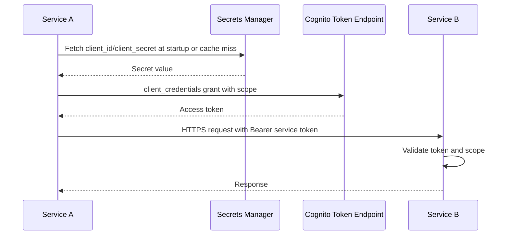

Example service scopes:

```text
taxnet/internal.case.read
taxnet/internal.case.write
taxnet/internal.identity.resolve
taxnet/internal.graph.read
taxnet/internal.graph.write
taxnet/internal.risk.score
taxnet/internal.rag.query
taxnet/internal.model.invoke
taxnet/internal.sandbox.read
```

MVP fallback:

- Use internal API keys only in local development.
- Store keys in LocalStack Secrets Manager or developer secrets.
- Send with `X-Internal-Api-Key`.
- Disable in production.

Production hardening:

- Private VPC networking.
- Security groups per service.
- TLS everywhere.
- Optional mTLS/service mesh if using EKS.
- IAM roles for AWS resource access.
- WAF for public endpoints.

### 10.3 API Key Usage

API keys are acceptable for:

- Sandbox dev-mode auth.
- Third-party provider credentials when required by provider.
- Legacy official provider integration if the provider only supports API keys.

API keys are not ideal for:

- Human auth.
- Main public API auth.
- Internal production service auth.

## 11. Secrets Management

### 11.1 Storage

Use AWS Secrets Manager for:

- Cognito client secrets.
- External LLM API keys.
- Local model service tokens if any.
- Government provider credentials.
- Sandbox API keys.
- Database connection strings if not using IAM auth.
- Neo4j/Memgraph credentials.
- Qdrant credentials.
- Redis auth token.
- Report signing keys.
- Webhook secrets.

Use AWS Systems Manager Parameter Store for:

- Non-secret config.
- Feature flags if not using a dedicated feature flag service.
- Public base URLs.
- Region names.
- Timeout values.

### 11.2 Secret Naming Convention

```text
/taxnet/{env}/cognito/service-clients/{serviceName}
/taxnet/{env}/providers/fbr/credentials
/taxnet/{env}/providers/nadra/credentials
/taxnet/{env}/providers/sandbox/credentials
/taxnet/{env}/ai/openai/api-key
/taxnet/{env}/ai/anthropic/api-key
/taxnet/{env}/ai/gemini/api-key
/taxnet/{env}/database/postgres
/taxnet/{env}/graph/neo4j
/taxnet/{env}/vector/qdrant
/taxnet/{env}/redis
```

Example secret JSON:

```json
{
  "clientId": "abc",
  "clientSecret": "secret",
  "tokenUrl": "https://taxnet.auth.region.amazoncognito.com/oauth2/token",
  "scopes": "taxnet/internal.graph.read taxnet/internal.graph.write"
}
```

### 11.3 Runtime Retrieval in .NET

Pattern:

- Services start with IAM role permissions to read only required secrets.
- Use AWS SDK for .NET.
- Use Secrets Manager caching library to reduce latency/cost.
- Never log secret values.
- Cache secrets with TTL.
- Support rotation by refetching after cache expiry.

Pseudo-code:

```csharp
public interface ISecretProvider
{
    Task<string> GetSecretStringAsync(string secretName, CancellationToken ct);
    Task<T> GetSecretAsync<T>(string secretName, CancellationToken ct);
}
```

Implementation:

```csharp
public sealed class AwsSecretsManagerSecretProvider : ISecretProvider
{
    private readonly IAmazonSecretsManager _client;
    private readonly IOptions<SecretOptions> _options;
    private readonly IMemoryCache _cache;

    public async Task<string> GetSecretStringAsync(string secretName, CancellationToken ct)
    {
        // 1. Check memory cache.
        // 2. Call Secrets Manager if cache miss.
        // 3. Cache with TTL.
        // 4. Return secret string.
        throw new NotImplementedException();
    }
}
```

IAM policy principle:

```text
Each service role can read only its own secrets.
No service gets wildcard access to all TaxNet secrets.
```

## 12. Data Architecture

### 12.1 Data Store Responsibilities

PostgreSQL:

- Users/role metadata mirrored from Cognito if needed.
- Cases.
- Resolved entities.
- Raw normalized record metadata.
- Scores.
- Audit decisions.
- Citizen corrections.
- Provider configs.
- Job status.
- Model evaluations.

Graph DB:

- Person nodes.
- Vehicle nodes.
- Property nodes.
- Business nodes.
- Utility meter nodes.
- Tax return nodes.
- Address nodes.
- Travel nodes.
- Relationships.

Vector DB:

- Policy document chunks.
- Audit SOP chunks.
- Public notice chunks.
- Explanation templates if useful.

S3:

- Raw input snapshots.
- Uploaded CSVs.
- Parsed document text.
- Evidence files.
- Generated reports.
- Graph exports.
- Model artifacts.
- RAG source snapshots.

Redis:

- Short-lived dashboard cache.
- Service token cache.
- Rate limit counters.
- Job locks.
- Feature flags cache.

### 12.2 Object Storage Buckets

```text
taxnet-{env}-raw-source-snapshots
taxnet-{env}-normalized-records
taxnet-{env}-evidence-files
taxnet-{env}-audit-reports
taxnet-{env}-rag-documents
taxnet-{env}-model-artifacts
taxnet-{env}-exports
```

S3 key format:

```text
raw-source-snapshots/{providerCode}/{yyyy}/{MM}/{dd}/{batchId}.json
evidence-files/{caseId}/{evidenceId}/{fileName}
audit-reports/{caseId}/{reportId}.pdf
rag-documents/{sourceType}/{sourceHash}/raw.pdf
model-artifacts/{modelName}/{version}/artifact.bin
```

### 12.3 Canonical Record Types

```text
IdentityProfile
TaxProfile
TaxReturn
VehicleRecord
PropertyRecord
UtilityBillRecord
BusinessRecord
BusinessRelationship
TravelRecord
AddressRecord
PhoneRecord
EvidenceRecord
```

### 12.4 Identity Token Strategy

For hackathon:

- Use synthetic `IdentityToken`.
- Use masked CNIC-like values.
- Use SHA-256 hashes with salt for matching tokens.

Production:

- Use provider-approved identity keys.
- Tokenize sensitive identifiers.
- Store raw identifiers only if legally allowed and encrypted.
- Keep raw ID access separate from analytics access.

## 13. Knowledge Graph Design

### 13.1 Node Types

```text
Person
IdentityDocument
TaxProfile
TaxReturn
Vehicle
Property
UtilityMeter
UtilityBill
Business
Address
Phone
TravelEvent
BankingSignalOptional
Case
Evidence
PolicyReference
```

### 13.2 Edge Types

```text
HAS_IDENTITY
HAS_ALIAS
HAS_PHONE
LIVES_AT
HAS_ADDRESS_HISTORY
FILED_RETURN
OWNS_VEHICLE
OWNS_PROPERTY
PAYS_UTILITY_BILL
DIRECTOR_OF
SHAREHOLDER_OF
TRAVELLED_TO
ASSOCIATED_WITH
FLAGGED_IN_CASE
SUPPORTED_BY_EVIDENCE
EXPLAINED_BY_POLICY
POSSIBLE_DUPLICATE_OF
HOUSEHOLD_MEMBER_OF
```

### 13.3 Graph Example

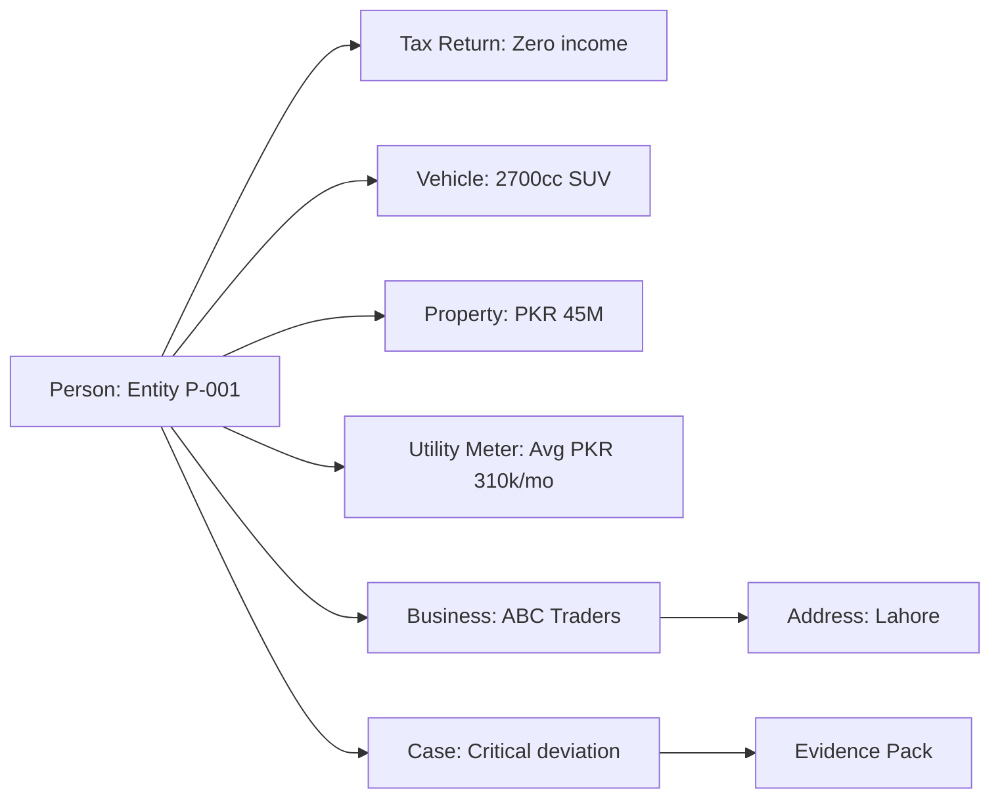

### 13.4 Graph Feature Extraction

Features:

```text
vehicle_count
luxury_vehicle_count
total_estimated_vehicle_value
property_count
total_estimated_property_value
business_count
director_count
avg_monthly_utility_bill
foreign_travel_count
asset_to_income_ratio
utility_to_income_ratio
business_to_income_ratio
network_high_risk_neighbor_count
identity_match_confidence
record_source_count
```

## 14. Entity Resolution Design

### 14.1 Goal

Link records referring to the same person/entity across disconnected datasets while producing confidence scores and reasons.

### 14.2 Matching Approach

Use a hybrid approach:

1. Deterministic matching
   - Same identity hash.
   - Same NTN/STRN.
   - Same phone hash.
   - Same passport hash.

2. Probabilistic/fuzzy matching
   - Name similarity.
   - Urdu/English transliteration similarity.
   - Father name similarity.
   - Address similarity.
   - City/province match.

3. Graph-assisted matching
   - Same business/address/phone relationships.
   - Shared household patterns.

### 14.3 Scoring Formula

Example:

```text
EntityMatchScore =
  0.40 * StrongIdentifierScore +
  0.20 * PhoneScore +
  0.15 * NameScore +
  0.10 * FatherNameScore +
  0.10 * AddressScore +
  0.05 * CityProvinceScore
```

Thresholds:

```text
>= 0.92 Auto-link
0.75-0.91 Review-link
0.55-0.74 Candidate-link
< 0.55 No-link
```

### 14.4 Output

```json
{
  "resolvedEntityId": "entity_001",
  "matchConfidence": 0.94,
  "records": [
    "tax_return_001",
    "vehicle_008",
    "utility_031"
  ],
  "reasons": [
    "Same identity hash",
    "Phone hash matched",
    "Name similarity 91%",
    "Same city"
  ],
  "requiresHumanReview": false
}
```

## 15. Risk Scoring Design

### 15.1 Core Principle

The risk score must be explainable and based on evidence. It should not be a black-box LLM output.

### 15.2 Score Components

Asset-income mismatch:

```text
High property/vehicle asset value with low declared income.
```

Utility-income mismatch:

```text
High recurring utility bills with low or zero declared income.
```

Vehicle luxury signal:

```text
Large engine capacity, luxury brand, high estimated value.
```

Property ownership mismatch:

```text
Ownership of high-value property without matching income/tax profile.
```

Business ownership mismatch:

```text
Director/shareholder in business but no matching declared income.
```

Travel/lifestyle mismatch:

```text
Frequent international travel with low declared income.
```

Filing behavior:

```text
Non-filer, late filer, zero filer, inconsistent filing history.
```

### 15.3 Score Output

```json
{
  "caseId": "case_001",
  "entityId": "entity_001",
  "score": 92,
  "riskBand": "Critical",
  "confidence": 0.88,
  "components": [
    {
      "name": "AssetIncomeMismatch",
      "score": 24,
      "maxScore": 25,
      "evidenceIds": ["vehicle_008", "property_011"]
    },
    {
      "name": "UtilityIncomeMismatch",
      "score": 18,
      "maxScore": 20,
      "evidenceIds": ["utility_bill_031"]
    }
  ],
  "recommendedAction": "HumanReview"
}
```

## 16. AI Architecture

### 16.1 Big Mind Placement

The main LLM should sit behind the AI Orchestrator and Model Gateway.

It should not directly query databases or make final decisions.

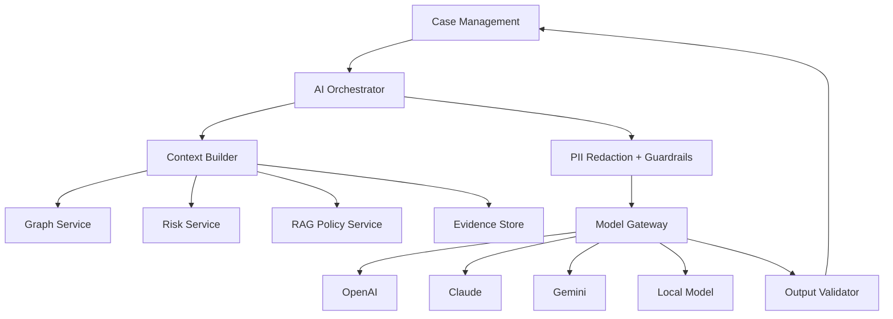

### 16.1.1 LLM Communication Flow

The LLM communication path must always go through controlled services.

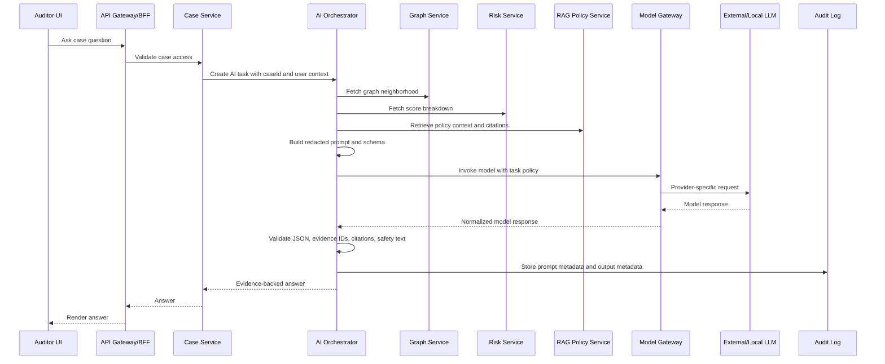

LLM call rules:

```text
The UI never calls a model provider directly.
The Case Service never builds raw LLM prompts.
The AI Orchestrator never decides tax guilt.
The Model Gateway never reads case databases directly.
The Output Validator rejects unsupported claims.
```

### 16.1.2 AI Orchestrator Internal Pipeline

```mermaid
flowchart LR
  TASK["AI Task Request"] --> POLICY["Task Policy Resolver"]
  POLICY --> ACCESS["Access Context Check"]
  ACCESS --> CTX["Context Builder"]
  CTX --> REDACT["PII Redaction"]
  REDACT --> PROMPT["Prompt Builder"]
  PROMPT --> ROUTE["Model Route Selection"]
  ROUTE --> INVOKE["Model Invocation"]
  INVOKE --> VALIDATE["Output Validation"]
  VALIDATE --> GROUND["Evidence Grounding Check"]
  GROUND --> AUDIT["Audit Metadata Write"]
  AUDIT --> RESPONSE["Structured Response"]
```

AI task types:

```text
AuditExplanation
CitizenExplanation
CaseSummary
ReportDraft
MissingEvidenceSuggestion
PolicyQuestion
GraphSummary
CorrectionResponseDraft
ModelEvaluationPrompt
```

Output validation checks:

```text
JSON schema is valid.
No raw PII leakage beyond caller authorization.
Every factual case claim references evidence IDs.
Every policy claim references RAG citations.
No language says "fraud proven" or "guilty".
Uncertainty is included when confidence is below threshold.
Human review warning is present for audit outputs.
```

### 16.2 What LLMs Are Used For

Good uses:

- Audit explanation.
- Citizen-friendly explanation.
- Report drafting.
- Summarizing graph evidence.
- Suggesting missing evidence.
- Turning policy context into plain language.
- Assistant Q&A for auditors.
- Urdu/English language rewriting.

Bad uses:

- Final fraud determination.
- Raw identity matching without rules.
- Scoring without structured evidence.
- Learning private data live.
- Generating unsupported claims.

### 16.3 Model Gateway Routing

Model request:

```json
{
  "taskType": "AuditExplanation",
  "sensitivity": "High",
  "requiresCitations": true,
  "preferredLatencyMs": 4000,
  "inputTokenEstimate": 3500,
  "outputSchema": "AuditExplanationV1"
}
```

Routing policy:

```text
If sensitivity is High and prompt contains raw PII:
  redact PII or use local model.
If task requires highest quality:
  use external frontier model.
If task is simple formatting:
  use local model.
If provider fails:
  fallback to another provider or return deterministic template.
```

Model Gateway design:

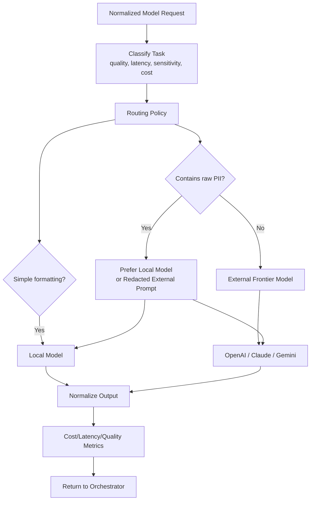

Model fallback order for MVP:

```text
1. Configured primary external provider.
2. Secondary external provider if configured.
3. Local model if available.
4. Deterministic template response.
```

### 16.4 RAG Role

RAG is the system's current policy memory.

RAG sources:

- FBR public notices.
- Public tax rules.
- Public excise fee schedules.
- SECP public guidance.
- Audit SOPs.
- Internal policy manuals if available.

RAG output:

```json
{
  "answerContext": "Retrieved text snippets...",
  "citations": [
    {
      "title": "FBR Notice Example",
      "url": "https://...",
      "capturedAtUtc": "2026-06-10T10:00:00Z",
      "chunkId": "chunk_001"
    }
  ]
}
```

### 16.5 Controlled Local Model Training

Do not self-train live.

Use controlled training:

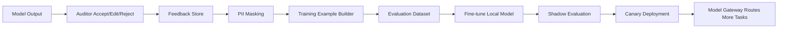

Local model should learn:

- Report structure.
- Explanation style.
- JSON schema adherence.
- Urdu/English phrasing.
- Common audit reasoning patterns.

Local model should not learn:

- Real CNICs.
- Raw citizen profiles.
- Unreviewed model outputs.
- Current law as memorized facts.

Rule:

```text
RAG teaches facts.
Fine-tuning teaches behavior.
```

## 17. RAG Pipeline

```mermaid
flowchart LR
  SRC["Approved Public Sources"] --> FETCH["PublicDataConnector.Worker"]
  FETCH --> S3RAW["S3 Raw Snapshot"]
  S3RAW --> PARSE["Parser"]
  PARSE --> CLEAN["Cleaner"]
  CLEAN --> CHUNK["Chunker"]
  CHUNK --> EMB["Embedding Worker"]
  EMB --> VDB["Vector DB"]
  VDB --> RAG["RAG Policy Service"]
  RAG --> ORCH["AI Orchestrator"]
```

RAG metadata:

```json
{
  "documentId": "doc_001",
  "sourceUrl": "https://example.gov.pk/notice.pdf",
  "sourceType": "PublicTaxNotice",
  "capturedAtUtc": "2026-06-10T10:00:00Z",
  "sha256": "hash",
  "parserVersion": "1.0.0",
  "chunkCount": 24
}
```

### 17.1 RAG Service Components

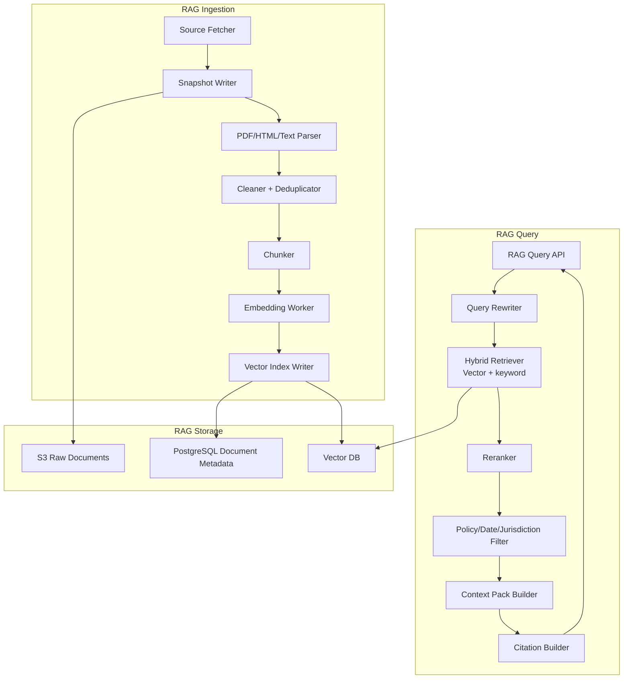

### 17.2 RAG Indexing Pipeline

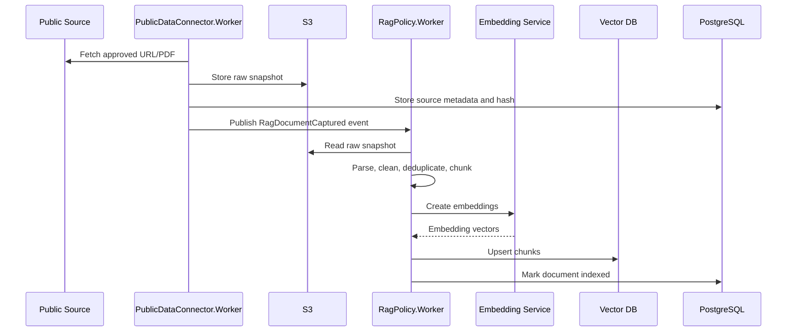

### 17.3 RAG Query Pipeline

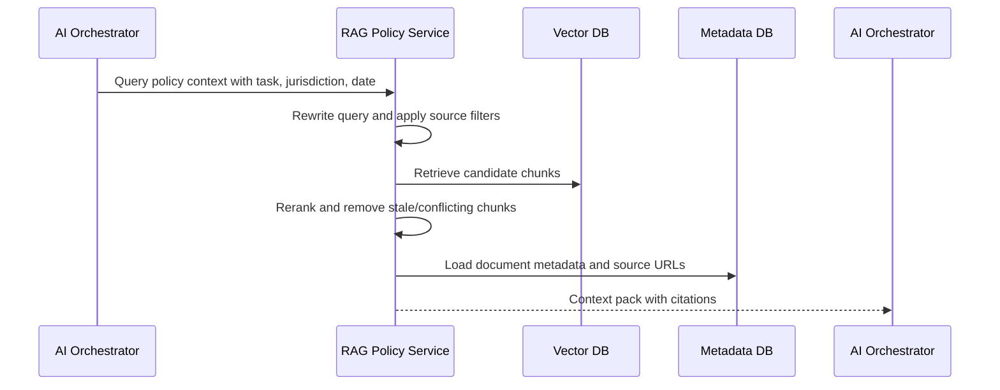

RAG query request:

```json
{
  "query": "Explain why a luxury vehicle is a compliance deviation signal for a zero filer.",
  "jurisdiction": "Pakistan",
  "sourceTypes": ["TaxNotice", "AuditSop", "ExciseSchedule"],
  "maxChunks": 8,
  "requireCitations": true,
  "asOfDate": "2026-06-10"
}
```

RAG query response:

```json
{
  "contextPackId": "ctx_001",
  "chunks": [
    {
      "chunkId": "chunk_001",
      "text": "Short retrieved excerpt or summarized context...",
      "sourceTitle": "Public tax policy document",
      "sourceUrl": "https://example.gov.pk/policy.pdf",
      "capturedAtUtc": "2026-06-10T10:00:00Z",
      "score": 0.87
    }
  ],
  "warnings": [
    "Policy context is informational and must be verified by authorized officials."
  ]
}
```

RAG quality checks:

```text
Reject documents with unknown source type.
Version every indexed document.
Keep raw source snapshots in S3 for audit.
Prefer recent documents when policy conflicts.
Return citations with capture timestamp.
Track no-result and low-confidence retrieval rates.
```

## 18. Event-Driven Architecture

Use SQS queues for async jobs.

Queues:

```text
taxnet-{env}-ingestion-jobs
taxnet-{env}-identity-resolution-jobs
taxnet-{env}-graph-build-jobs
taxnet-{env}-risk-score-jobs
taxnet-{env}-rag-index-jobs
taxnet-{env}-report-jobs
taxnet-{env}-notification-jobs
taxnet-{env}-audit-log-jobs
```

Each queue has a DLQ:

```text
taxnet-{env}-risk-score-jobs-dlq
```

Event envelope:

```json
{
  "eventId": "evt_001",
  "eventType": "RecordBatchImported",
  "version": "1.0",
  "occurredAtUtc": "2026-06-10T10:00:00Z",
  "correlationId": "corr_001",
  "causationId": "cmd_001",
  "tenantId": "default",
  "payload": {}
}
```

Main event flow:

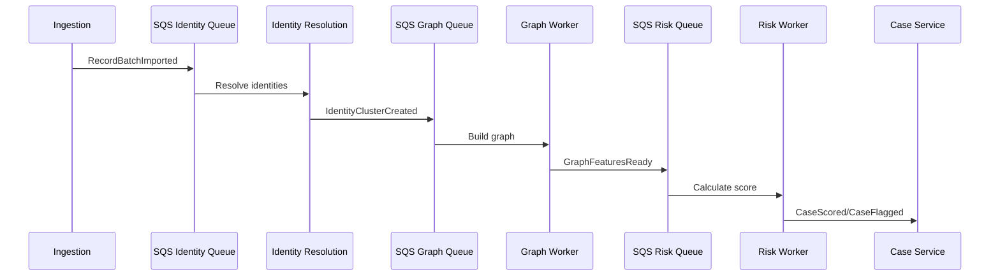

### 18.1 Worker Topology

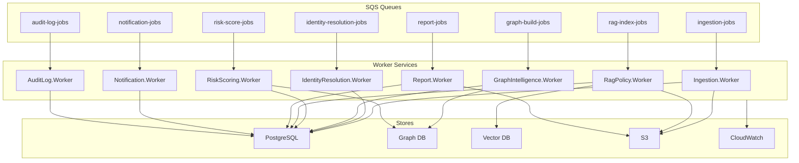

### 18.2 Worker Responsibilities

| Worker | Trigger | Reads | Writes | Emits |
|---|---|---|---|---|
| `Ingestion.Worker` | `ingestion-jobs` | Sandbox/connector APIs, S3 raw files | PostgreSQL normalized records, S3 snapshots | `RecordBatchImported` |
| `IdentityResolution.Worker` | `identity-resolution-jobs` | Normalized records | Resolved entities, match reasons | `IdentityClusterCreated` |
| `GraphIntelligence.Worker` | `graph-build-jobs` | Resolved entities, normalized records | Graph nodes/edges, graph features | `GraphFeaturesReady` |
| `RiskScoring.Worker` | `risk-score-jobs` | Graph features, tax/asset signals | Risk score, score components, case flags | `CaseScored`, `CaseFlagged` |
| `RagPolicy.Worker` | `rag-index-jobs` | S3 policy docs, source metadata | Vector chunks, document metadata | `RagDocumentIndexed` |
| `Report.Worker` | `report-jobs` | Case, evidence, graph snapshot, explanation | PDF/CSV reports in S3 | `ReportGenerated` |
| `Notification.Worker` | `notification-jobs` | Notification job payload | In-app/email/SNS notification | `NotificationSent` |
| `AuditLog.Worker` | `audit-log-jobs` | Audit event payload | Immutable audit table/log stream | none |

### 18.3 End-to-End Worker Pipeline

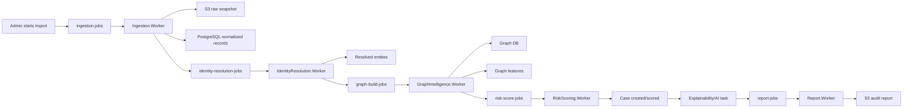

### 18.4 Worker Failure and Retry Rules

Each worker must implement:

```text
Idempotency key per message.
Correlation ID propagation.
Exponential backoff.
Max receive count before DLQ.
Poison message logging.
Partial failure tracking.
Structured logs and metrics.
Audit event for sensitive state changes.
```

Failure handling:

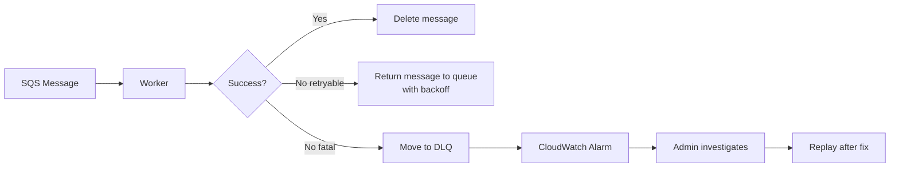

Idempotency examples:

```text
Import batch id prevents duplicate normalized records.
Resolved entity job id prevents duplicate identity clusters.
Graph build version prevents duplicate edges.
Risk score version prevents duplicate case scores.
Report job id prevents duplicate PDF exports.
```

### 18.5 Worker Scaling Rules

```text
Scale workers based on queue depth and oldest message age.
Identity resolution and graph workers need stronger CPU/memory limits.
RAG indexing workers need network and embedding-provider rate limit controls.
Report workers need concurrency limits to avoid memory spikes.
Audit log workers should be highly reliable and low latency.
```

Suggested MVP concurrency:

| Worker | MVP Concurrency | Production Scaling Signal |
|---|---:|---|
| Ingestion | 2 | Queue depth, provider rate limits |
| Identity Resolution | 2 | Queue age, CPU |
| Graph Build | 1 | Graph DB write latency |
| Risk Scoring | 4 | Queue depth, DB latency |
| RAG Indexing | 1 | Embedding rate limits |
| Report Generation | 2 | Memory, queue age |
| Notification | 4 | Queue depth |
| Audit Log | 4 | Queue age, error rate |

### 18.6 Communication Patterns

Use synchronous HTTP/gRPC for:

```text
Frontend requests.
Case detail reads.
Graph neighborhood reads.
RAG query from AI Orchestrator.
Model invocation through Model Gateway.
Provider health checks.
```

Use asynchronous SQS events for:

```text
Imports.
Identity resolution.
Graph rebuilds.
Risk scoring.
RAG indexing.
Report generation.
Notifications.
Audit log writes.
```

Communication map:

```mermaid
flowchart TB
  UI["React Apps"] -->|HTTPS JWT| BFF["API Gateway/BFF"]
  BFF -->|Internal OAuth| CASE["Case Service"]
  CASE -->|Sync read| GRAPH["Graph API"]
  CASE -->|Sync read| RISK["Risk API"]
  CASE -->|Async command| SQS["SQS"]
  SQS --> WORKERS["Workers"]
  WORKERS --> STORES["PostgreSQL / Graph DB / S3 / Vector DB"]
  CASE -->|AI task| ORCH["AI Orchestrator"]
  ORCH -->|Sync| RAG["RAG Policy API"]
  ORCH -->|Sync| MODEL["Model Gateway"]
  MODEL -->|Provider API| LLM["External or Local LLM"]
```

## 19. API Contracts

### 19.1 Case API

```http
GET /api/cases?riskBand=Critical&status=FlaggedForReview
```

Response:

```json
{
  "items": [
    {
      "caseId": "case_001",
      "entityId": "entity_001",
      "riskBand": "Critical",
      "score": 92,
      "confidence": 0.88,
      "city": "Lahore",
      "topReasons": [
        "Zero declared income",
        "Luxury vehicle ownership",
        "High utility consumption"
      ],
      "status": "FlaggedForReview",
      "assignedTo": null
    }
  ],
  "total": 1
}
```

### 19.2 Case Detail API

```http
GET /api/cases/{caseId}
```

Response includes:

- Case summary.
- Entity profile.
- Risk score.
- Evidence.
- Graph neighborhood.
- Audit trail.
- Citizen corrections.
- Model explanation.

### 19.3 Graph API

```http
GET /api/graph/entities/{entityId}/neighborhood?depth=2
```

Response:

```json
{
  "nodes": [
    {
      "id": "entity_001",
      "type": "Person",
      "label": "Entity P-001",
      "riskBand": "Critical"
    }
  ],
  "edges": [
    {
      "id": "edge_001",
      "source": "entity_001",
      "target": "vehicle_001",
      "type": "OWNS_VEHICLE",
      "confidence": 0.95
    }
  ]
}
```

### 19.4 Assistant API

```http
POST /api/assistant/cases/{caseId}/ask
```

Request:

```json
{
  "question": "Why was this case marked critical?"
}
```

Response:

```json
{
  "answer": "This case was marked critical because the structured evidence shows...",
  "evidenceIds": ["evidence_001", "evidence_002"],
  "citations": [
    {
      "title": "Policy document",
      "url": "https://...",
      "chunkId": "chunk_001"
    }
  ],
  "warnings": [
    "This is a decision-support explanation and requires human review."
  ]
}
```

### 19.5 Citizen Correction API

```http
POST /api/citizen/corrections
```

Request:

```json
{
  "caseId": "case_001",
  "correctionType": "AssetOwnershipDispute",
  "message": "The vehicle is no longer owned by me.",
  "evidenceFileIds": ["file_001"]
}
```

## 20. Frontend Applications

### 20.1 Auditor Dashboard

Routes:

```text
/dashboard
/cases
/cases/:caseId
/cases/:caseId/graph
/cases/:caseId/evidence
/cases/:caseId/report
/assistant
/policy-search
```

Key screens:

1. National overview
   - Total cases.
   - Critical/high/medium/low distribution.
   - Estimated recoverable tax.
   - Top cities/sectors.
   - Queue health.

2. Case list
   - Filters by risk band, city, status, reason, score.
   - Sort by score/confidence/date.

3. Case detail
   - Profile summary.
   - Score breakdown.
   - Evidence cards.
   - Audit trail.
   - Action buttons.

4. Graph explorer
   - Interactive graph.
   - Node filtering.
   - Relationship labels.
   - Evidence drawer.

5. Assistant panel
   - Ask case questions.
   - Generate report summary.
   - Suggest missing evidence.

6. Report screen
   - Preview PDF.
   - Export.
   - Audit watermark.

### 20.2 Citizen Portal

Routes:

```text
/citizen/home
/citizen/profile
/citizen/compliance-summary
/citizen/corrections
/citizen/corrections/:correctionId
/citizen/guidance
```

Important design:

- Citizen only sees their own safe summary.
- Avoid exposing investigative signals that enable evasion.
- Provide correction and guidance flow.
- Use plain language.

### 20.3 Sandbox Admin UI

Routes:

```text
/sandbox
/sandbox/providers
/sandbox/generate
/sandbox/profiles
/sandbox/profiles/:id
/sandbox/patterns
/sandbox/failure-simulator
/sandbox/api-keys
/sandbox/real-provider-readiness
```

This app is separate from the main auditor dashboard.

## 21. Observability

### 21.1 Logging

Use structured logs with Serilog.

Common fields:

```text
timestamp
level
service
environment
correlationId
traceId
spanId
actorId
actorType
caseId
entityId
providerCode
eventType
durationMs
statusCode
errorCode
```

Never log:

- Raw CNIC.
- Raw phone.
- Passwords.
- API keys.
- OAuth tokens.
- LLM provider keys.
- Full citizen address unless explicitly approved and masked.

### 21.2 Metrics

Core metrics:

```text
api_request_count
api_request_latency_ms
api_error_rate
queue_depth
queue_message_age
worker_success_count
worker_failure_count
identity_resolution_precision
identity_resolution_recall
risk_score_distribution
case_false_positive_rate
case_closure_rate
model_invocation_count
model_latency_ms
model_cost_estimate
rag_retrieval_latency_ms
rag_no_result_rate
report_generation_latency_ms
```

### 21.3 Alerts

CloudWatch alarms:

```text
API 5xx rate > 2% for 5 minutes
Queue age > 10 minutes
DLQ messages > 0
Identity resolution worker failures > threshold
Risk score job failures > threshold
RAG indexing failures > threshold
Model provider failure rate > threshold
Secrets retrieval failures > 0
Database CPU/storage threshold
Graph DB unavailable
High-risk case spike anomaly
```

### 21.4 Tracing

Use OpenTelemetry.

Trace key flows:

- Case detail load.
- Import batch.
- Entity resolution job.
- Graph build job.
- Risk score calculation.
- AI explanation generation.
- Report generation.

## 22. Security and Privacy

### 22.1 Core Security Controls

- Cognito for user authentication.
- Role and scope authorization.
- Service-to-service OAuth tokens.
- IAM roles for AWS resource access.
- Secrets Manager for secrets.
- KMS encryption for S3, RDS, SQS, Secrets Manager.
- Private VPC for internal services.
- HTTPS everywhere.
- WAF on public endpoints.
- Rate limiting.
- Audit logs.
- PII masking/tokenization.
- Least privilege database access.

### 22.2 Privacy Controls

- Use synthetic data for hackathon.
- Mask CNIC-like values.
- Hash identifiers with salt.
- Separate raw identity fields from analytics fields.
- Keep citizen correction evidence access-controlled.
- Redact PII before external LLM calls unless approved.
- Maintain model prompt logs with PII masking.
- Support data retention policies.

### 22.3 Ethical Controls

- AI flags for review only.
- Show confidence and evidence quality.
- Show false-positive warning.
- Provide citizen correction path.
- Require human decision.
- Track auditor decisions.
- Monitor bias by city, region, gender if such attributes are used and legally allowed.

## 23. Deployment Architecture

### 23.1 Local Development

```mermaid
flowchart TB
  DEV["Developer Machine"] --> DOCKER["Docker Compose"]
  DOCKER --> PG["Postgres"]
  DOCKER --> NEO["Neo4j/Memgraph"]
  DOCKER --> QD["Qdrant"]
  DOCKER --> REDIS["Redis"]
  DOCKER --> LS["LocalStack\nS3/SQS/Secrets"]
  DEV --> DOTNET[".NET Services"]
  DEV --> REACT["React Apps"]
  DOTNET --> LS
  DOTNET --> PG
  DOTNET --> NEO
  DOTNET --> QD
```

Use .NET Aspire if available to orchestrate:

- API Gateway.
- Core APIs.
- Workers.
- Postgres.
- Redis.
- LocalStack.
- Frontend dev servers.

### 23.2 AWS Production

```mermaid
flowchart TB
  USER["Users"] --> CF["CloudFront"]
  CF --> FE["S3/Amplify React Apps"]
  USER --> APIGW["API Gateway or ALB"]
  APIGW --> COG["Cognito"]
  APIGW --> ECS["ECS Fargate Services"]
  ECS --> RDS["RDS PostgreSQL"]
  ECS --> GDB["Graph DB"]
  ECS --> VDB["Vector DB"]
  ECS --> REDIS["ElastiCache Redis"]
  ECS --> SQS["SQS"]
  ECS --> S3["S3"]
  ECS --> SM["Secrets Manager"]
  ECS --> CW["CloudWatch"]
  SQS --> WORKERS["ECS Worker Services"]
```

## 24. Build Procedure

### 24.0 Hackathon Scope Control

The architecture is production-grade, but the 3-day build must be focused.

Build physically in the MVP:

```text
TaxNet.GovDataSandbox.Api
TaxNet.Main.Api
TaxNet.Worker
auditor-dashboard
sandbox-admin-ui
```

Keep as logical modules inside `TaxNet.Main.Api` or `TaxNet.Worker`:

```text
Case Management
Ingestion
Identity Resolution
Graph Intelligence
Risk Scoring
Explainability
RAG Policy
Model Gateway
Audit Log
Report Generation
```

Explain as future deployable services:

```text
Notification Service
Public Data Connector Worker
MLOps Training Worker
Advanced real government adapters
CloudWatch production alarms
Citizen Portal if time is tight
```

Reason:

```text
Judges need to see a working end-to-end product, not 15 half-working services.
The code should be modular enough to split later, but the demo must be smooth.
```

### 24.1 Phase 0 - Repo Setup

Create solution structure:

```text
TaxNetGuardian.sln

src/
  TaxNet.ApiGateway/
  TaxNet.ServiceDefaults/
  TaxNet.Contracts/
  TaxNet.Domain/
  TaxNet.Infrastructure/

  TaxNet.CaseManagement.Api/
  TaxNet.Ingestion.Api/
  TaxNet.Ingestion.Worker/
  TaxNet.IdentityResolution.Worker/
  TaxNet.GraphIntelligence.Api/
  TaxNet.GraphIntelligence.Worker/
  TaxNet.RiskScoring.Api/
  TaxNet.RiskScoring.Worker/
  TaxNet.Explainability.Api/
  TaxNet.Report.Worker/
  TaxNet.Notification.Worker/
  TaxNet.AuditLog.Api/

  TaxNet.AI.Orchestrator.Api/
  TaxNet.AI.ModelGateway.Api/
  TaxNet.RagPolicy.Api/
  TaxNet.RagPolicy.Worker/
  TaxNet.PublicDataConnector.Worker/

  TaxNet.GovDataSandbox.Api/

apps/
  auditor-dashboard/
  citizen-portal/
  sandbox-admin-ui/

infra/
  docker-compose.yml
  localstack/
  terraform/

docs/
  TaxNetGuardian_System_Design.md
```

For 3-day hackathon, it is acceptable to implement many services as modules inside fewer deployable projects:

```text
TaxNet.Api
TaxNet.Worker
TaxNet.GovDataSandbox.Api
auditor-dashboard
sandbox-admin-ui
```

But keep the code organized by service boundaries.

### 24.2 Phase 1 - Sandbox First

Build:

- `GovDataSandbox.Api`
- `Sandbox Admin UI`
- Synthetic data generator
- Mock provider endpoints

Reason:

```text
The entire product depends on believable data.
```

Minimum seed:

```text
500 synthetic persons
5 data domains
50 suspicious cases
50 clean citizens
30 identity ambiguity cases
```

### 24.3 Phase 2 - Ingestion and Canonical Model

Build:

- Connector interface.
- Sandbox provider implementation.
- Ingestion endpoint.
- Raw snapshot S3 storage.
- Normalized records in PostgreSQL.

### 24.4 Phase 3 - Entity Resolution

Build:

- Deterministic matching.
- Fuzzy matching.
- Confidence score.
- Match reason output.
- Evaluation dashboard for precision/recall on synthetic labels.

### 24.5 Phase 4 - Graph and Risk

Build:

- Graph nodes and edges.
- Graph neighborhood API.
- Feature extraction.
- Risk scoring.
- Case creation.

### 24.6 Phase 5 - Auditor Dashboard

Build:

- Overview.
- Case list.
- Case detail.
- Graph explorer.
- Score breakdown.
- Evidence cards.

### 24.7 Phase 6 - AI, RAG, and Reports

Build:

- RAG ingestion for 3 to 5 sample policy docs.
- AI Orchestrator.
- Model Gateway with one external provider.
- Explanation service.
- PDF report export.

### 24.8 Phase 7 - Citizen Portal

Build:

- Citizen login mock/Cognito.
- Case summary.
- Correction submission.
- Evidence upload.
- Status tracking.

### 24.9 Phase 8 - Observability and Security Polish

Build:

- Structured logs.
- Correlation IDs.
- Health checks.
- Basic metrics.
- CloudWatch-ready logging.
- Secrets Manager integration.
- Role/scope authorization.

## 25. 3-Day Hackathon Execution Plan

### Day 1

Deliver:

- Final architecture diagrams.
- Sandbox backend endpoints.
- Synthetic data generator.
- Ingestion from sandbox.
- Entity resolution MVP.
- PostgreSQL schema.

Demo checkpoint:

```text
Generate synthetic citizens in sandbox UI.
Import them into TaxNet.
Show resolved identities and match confidence.
```

### Day 2

Deliver:

- Graph build.
- Risk scoring.
- Case creation.
- Auditor dashboard.
- Graph visualization.
- Evidence cards.

Demo checkpoint:

```text
Open critical case.
Show graph.
Show score breakdown.
Show evidence.
```

### Day 3

Deliver:

- RAG policy service.
- AI explanations.
- PDF report.
- Citizen correction portal.
- Observability screen.
- Final pitch.

Demo checkpoint:

```text
Ask assistant why case is critical.
Generate audit report.
Submit citizen correction.
Show score/case status changes.
```

## 26. Demo Script

1. Open Sandbox Admin UI.
2. Show synthetic government providers.
3. Generate 500 citizens with 50 suspicious cases.
4. Open one synthetic profile showing tax, vehicle, property, utility, business, and travel data.
5. Switch to Auditor Dashboard.
6. Import sandbox dataset.
7. Show identity resolution accuracy.
8. Open high-risk case.
9. Show graph: person linked to vehicle, property, utility, business.
10. Show Tax Compliance Deviation Score.
11. Click "Explain".
12. AI generates evidence-backed explanation with policy citations.
13. Generate PDF case report.
14. Switch to Citizen Portal.
15. Citizen sees safe explanation and submits correction.
16. Auditor reviews correction and closes as verified/false positive/escalated.
17. End with architecture slide: sandbox APIs can be replaced by official provider adapters.

## 27. Winning Differentiators

### 27.1 Separate Gov Data Sandbox

Most teams will hardcode CSVs. TaxNet has a realistic government integration emulator with its own UI and API.

### 27.2 Replaceable Provider Contracts

The system is ready for official NADRA/FBR/Excise integrations when legal access exists.

### 27.3 Citizen Correction Portal

This reduces ethical risk and shows fairness.

### 27.4 Explainable Graph, Not Just LLM

The core evidence comes from graph and structured scoring.

### 27.5 Model Gateway

The system is not locked into one LLM provider.

### 27.6 Controlled Local Learning Loop

The product can reduce external LLM cost over time while protecting privacy.

### 27.7 Observability and Auditability

CloudWatch, audit logs, correlation IDs, DLQs, and score versioning make it enterprise-ready.

## 28. Interface Summary for Another LLM or Developer

If another LLM receives this document, it should build the project in this order:

1. Create the repository structure in section 24.
2. Create shared `TaxNet.Contracts` DTOs.
3. Build `GovDataSandbox.Api` with endpoints in section 9.3.
4. Build `sandbox-admin-ui`.
5. Build `IGovernmentDataProvider` and `SandboxGovernmentDataProvider`.
6. Build ingestion from sandbox.
7. Build canonical PostgreSQL schema.
8. Build identity resolution.
9. Build graph nodes/edges and graph API.
10. Build risk scoring.
11. Build case management.
12. Build auditor dashboard.
13. Build RAG service.
14. Build AI Orchestrator and Model Gateway.
15. Build explanation service.
16. Build citizen portal.
17. Add auth, secrets, logs, metrics, and alerts.

Implementation rule:

```text
The sandbox must remain replaceable.
No core service should depend on sandbox-specific DTOs.
All provider outputs must map into canonical TaxNet contracts.
```

## 29. Critical DTOs

### 29.1 IdentityToken

```csharp
public sealed record IdentityToken(
    string Value,
    string TokenType,
    string Issuer,
    bool IsSynthetic);
```

### 29.2 TaxProfileDto

```csharp
public sealed record TaxProfileDto(
    string ProviderRecordId,
    IdentityToken IdentityToken,
    string? Ntn,
    string FilerStatus,
    decimal DeclaredAnnualIncome,
    decimal TaxPaid,
    int TaxYear,
    DateTimeOffset SourceUpdatedAtUtc);
```

### 29.3 VehicleRecordDto

```csharp
public sealed record VehicleRecordDto(
    string ProviderRecordId,
    IdentityToken OwnerIdentityToken,
    string RegistrationNumberMasked,
    string Make,
    string Model,
    int EngineCc,
    int ModelYear,
    decimal EstimatedValue,
    string Province,
    DateTimeOffset SourceUpdatedAtUtc);
```

### 29.4 PropertyRecordDto

```csharp
public sealed record PropertyRecordDto(
    string ProviderRecordId,
    IdentityToken OwnerIdentityToken,
    string PropertyToken,
    string City,
    string Area,
    string PropertyType,
    decimal EstimatedValue,
    DateTimeOffset SourceUpdatedAtUtc);
```

### 29.5 UtilityBillRecordDto

```csharp
public sealed record UtilityBillRecordDto(
    string ProviderRecordId,
    IdentityToken OwnerIdentityToken,
    string MeterToken,
    string UtilityType,
    decimal AverageMonthlyBill,
    decimal LatestBillAmount,
    string City,
    DateTimeOffset SourceUpdatedAtUtc);
```

### 29.6 BusinessRecordDto

```csharp
public sealed record BusinessRecordDto(
    string ProviderRecordId,
    string CompanyRegistrationNumber,
    string CompanyName,
    string RelationshipType,
    IdentityToken RelatedIdentityToken,
    string Status,
    DateTimeOffset SourceUpdatedAtUtc);
```

### 29.7 RiskScoreDto

```csharp
public sealed record RiskScoreDto(
    string CaseId,
    string ResolvedEntityId,
    int Score,
    string RiskBand,
    decimal Confidence,
    IReadOnlyList<RiskScoreComponentDto> Components,
    string RecommendedAction,
    string ScoreVersion);
```

### 29.8 AuditExplanationDto

```csharp
public sealed record AuditExplanationDto(
    string CaseId,
    string Summary,
    IReadOnlyList<string> KeyReasons,
    IReadOnlyList<string> EvidenceIds,
    IReadOnlyList<PolicyCitationDto> Citations,
    string HumanReviewWarning);
```

## 30. Environment Configuration

Example variables:

```text
ASPNETCORE_ENVIRONMENT=Development
AWS_REGION=ap-south-1
TAXNET_ENV=dev
COGNITO_AUTHORITY=https://cognito-idp.{region}.amazonaws.com/{userPoolId}
COGNITO_AUDIENCE={appClientId}
SECRETS_PREFIX=/taxnet/dev
S3_BUCKET_RAW=taxnet-dev-raw-source-snapshots
S3_BUCKET_REPORTS=taxnet-dev-audit-reports
SQS_QUEUE_RISK=taxnet-dev-risk-score-jobs
POSTGRES_SECRET_NAME=/taxnet/dev/database/postgres
GRAPH_SECRET_NAME=/taxnet/dev/graph/neo4j
VECTOR_SECRET_NAME=/taxnet/dev/vector/qdrant
MODEL_GATEWAY_DEFAULT_PROVIDER=openai
```

## 31. Risk Register

| Risk | Impact | Mitigation |
|---|---|---|
| Judges question data access | High | Clearly state synthetic sandbox and future official connectors |
| False positives | High | Human review, confidence score, citizen correction portal |
| LLM hallucination | High | RAG citations, output validation, evidence-only explanations |
| Too many services for 3 days | Medium | Implement modular monolith MVP, keep service boundaries in code |
| Graph DB setup delays | Medium | Fallback to NetworkX/JSON graph for MVP |
| Auth setup delays | Medium | Use Cognito design; local dev JWT fallback |
| LocalStack setup delays | Medium | Use local filesystem fallback for S3 in MVP if needed |
| Model provider outage | Medium | Model Gateway fallback and deterministic templates |
| Privacy concerns | High | Synthetic data, tokenization, redaction, audit logs |

## 32. Final Recommendation

For the hackathon, build a practical MVP with professional architecture:

```text
One runnable backend can contain multiple modules,
but the design must show clear service boundaries.
```

Minimum deployable systems:

1. Gov Data Sandbox API.
2. Sandbox Admin UI.
3. Main TaxNet API.
4. Worker for identity/graph/risk jobs.
5. Auditor Dashboard.
6. Optional Citizen Portal if time allows.

Must-have demo features:

- Generate synthetic data.
- Replaceable provider contracts.
- Import records.
- Resolve identities.
- Build graph.
- Score risk.
- Explain case.
- Show graph dashboard.
- Generate report.
- Show citizen correction path.

Final judge message:

```text
TaxNet Guardian does not depend on unsafe data access or black-box AI. It uses a synthetic Gov Data Sandbox today, replaceable official connectors tomorrow, graph-based evidence, RAG-grounded explanations, Cognito-secured access, Secrets Manager runtime configuration, and human-reviewed case management to make tax compliance intelligence fair, scalable, and production-ready.
```
